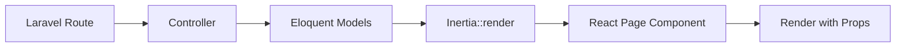

# Landing Page Implementation Plan for BOBATHON (Laravel/Inertia)

## Executive Summary

This document outlines the step-by-step plan to port the landing page design from `kathy-pm-demo` (standalone React SPA) into the `BOBATHON` Laravel/Inertia.js architecture. The goal is to maintain consistency with the existing Laravel backend while implementing the new UI design.

---

## Architecture Overview

### Current BOBATHON Architecture
- **Backend**: Laravel 11 with SQLite database
- **Frontend**: React 18 + TypeScript
- **Bridge**: Inertia.js (server-side routing with React components)
- **Build Tool**: Vite with Laravel plugin
- **UI Framework**: Carbon Design System
- **Entry Point**: `resources/js/app.tsx`
- **Pages**: `resources/js/Pages/*.tsx` (Inertia pages)
- **Layout**: `resources/js/Layouts/AppLayout.tsx` (persistent shell)

### Key Differences from kathy-pm-demo
| Aspect | kathy-pm-demo | BOBATHON |
|--------|---------------|----------|
| Routing | React Router (client-side) | Inertia.js (server-side) |
| Data | Mock JSON files | Laravel database + Eloquent |
| Navigation | `useNavigate()` hook | `router.visit()` from Inertia |
| State | React Context | Inertia props from controllers |
| Layout | React Router layouts | Inertia page layouts |

---

## Implementation Strategy

### Phase 1: Foundation Setup
**Goal**: Prepare the directory structure and understand data flow

#### 1.1 Create Directory Structure
```
BOBATHON/resources/js/
├── Components/
│   ├── Landing/          # NEW - Landing page tab components
│   │   ├── ProjectsTab.tsx
│   │   ├── CalendarTab.tsx
│   │   └── DeliverablesTab.tsx
│   ├── Navigation/       # NEW - Sidebar navigation
│   │   └── Sidebar.tsx
│   └── ui.tsx           # Existing - shared UI components
├── Pages/
│   ├── Landing.tsx       # NEW - Landing page (new home)
│   ├── Dashboard.tsx     # EXISTING - Keep as "Command Centre"
│   ├── ProjectsOverview.tsx  # NEW - Project tiles page
│   ├── ProjectDetail.tsx     # NEW - Individual project view
│   ├── ProjectSummary.tsx    # NEW - AI summaries
│   ├── Deliverables.tsx      # NEW - Deliverables page
│   ├── Agenda.tsx            # NEW - Meeting agenda
│   └── Prep.tsx              # NEW - Meeting prep
└── Layouts/
    ├── AppLayout.tsx     # EXISTING - Update for sidebar support
    └── SidebarLayout.tsx # NEW - Layout with sidebar

BOBATHON/resources/scss/
├── app.scss              # EXISTING - Main styles
├── _landing.scss         # NEW - Landing page styles
├── _sidebar.scss         # NEW - Sidebar styles
└── _projects.scss        # NEW - Projects overview styles
```

#### 1.2 Data Flow Analysis


**Key Insight**: Unlike kathy-pm-demo which uses React Context, BOBATHON passes data as props from Laravel controllers through Inertia.

---

## Phase 2: Landing Page Implementation

### 2.1 Create Landing Page Component

**File**: `resources/js/Pages/Landing.tsx`

**Purpose**: New home page with user profile and three tabs

**Props Structure**:
```typescript
interface LandingProps {
    currentUser: {
        name: string;
        role: string;
        initials: string;
    };
    projects: Project[];
    meetings: Meeting[];
    actions: Action[];
    communications: Communication[];
    reminders: Reminder[];
}
```

**Key Adaptations**:
- Remove React Router's `useNavigate()` → Use Inertia's `router.visit()`
- Remove Context API → Use props from controller
- Keep Carbon Design System components (already installed)
- Use existing `AppLayout` but without sidebar

**Implementation Notes**:
```typescript
import { Head, router } from '@inertiajs/react';
import { Grid, Column, Tabs, TabList, Tab, TabPanels, TabPanel, Tile } from '@carbon/react';
import { UserAvatar } from '@carbon/icons-react';

// No layout wrapper needed - AppLayout is applied automatically
export default function Landing({ currentUser, projects, meetings, actions, communications, reminders }: LandingProps) {
    return (
        <>
            <Head title="Welcome" />
            {/* Landing page content */}
        </>
    );
}

// Opt out of default AppLayout for landing page
Landing.layout = (page: ReactNode) => page;
```

### 2.2 Create Tab Components

#### ProjectsTab Component
**File**: `resources/js/Components/Landing/ProjectsTab.tsx`

**Changes from kathy-pm-demo**:
```typescript
// OLD (kathy-pm-demo)
const { state } = useAppContext();
const navigate = useNavigate();
navigate('/app/projects');

// NEW (BOBATHON)
interface ProjectsTabProps {
    projects: Project[];
}
router.visit('/projects-overview');
```

#### CalendarTab Component
**File**: `resources/js/Components/Landing/CalendarTab.tsx`

**Data Source**: Props instead of Context
```typescript
interface CalendarTabProps {
    meetings: Meeting[];
    actions: Action[];
    reminders: Reminder[];
}
```

#### DeliverablesTab Component
**File**: `resources/js/Components/Landing/DeliverablesTab.tsx`

**Data Source**: Props instead of Context
```typescript
interface DeliverablesTabProps {
    communications: Communication[];
    actions: Action[];
}
```

---

## Phase 3: Navigation & Sidebar

### 3.1 Create Sidebar Component

**File**: `resources/js/Components/Navigation/Sidebar.tsx`

**Key Changes**:
```typescript
// OLD (kathy-pm-demo)
import { useNavigate, useLocation } from 'react-router-dom';
const navigate = useNavigate();
navigate(item.path);

// NEW (BOBATHON)
import { router, usePage } from '@inertiajs/react';
const page = usePage();
router.visit(item.path);
const isActive = page.url === item.path;
```

**Navigation Items**:
```typescript
const navItems = [
    { path: '/', label: 'Main Page', icon: Home },
    { path: '/dashboard', label: 'Command Centre', icon: Dashboard },
    { path: '/projects-overview', label: 'Projects', icon: Grid },
    { path: '/project-summary', label: 'Summary', icon: ChartLine },
    { path: '/deliverables', label: 'Deliverables', icon: DeliveryTruck },
    { path: '/agenda', label: 'Agenda', icon: Calendar },
    { path: '/prep', label: 'Prep', icon: Document },
];
```

### 3.2 Create Sidebar Layout

**File**: `resources/js/Layouts/SidebarLayout.tsx`

**Purpose**: Wrapper layout that includes sidebar for app pages

```typescript
import { ReactNode } from 'react';
import AppLayout from './AppLayout';
import Sidebar from '@/Components/Navigation/Sidebar';

export default function SidebarLayout({ children }: { children: ReactNode }) {
    return (
        <AppLayout>
            <div className="app-with-sidebar">
                <Sidebar />
                <main className="sidebar-content">
                    {children}
                </main>
            </div>
        </AppLayout>
    );
}
```

### 3.3 Update AppLayout

**File**: `resources/js/Layouts/AppLayout.tsx`

**Changes**:
- Keep existing header navigation
- Remove header nav items that are now in sidebar
- Conditionally show different header based on route

```typescript
// Simplified header for landing page
const isLanding = url === '/';

// Show minimal header on landing, full header elsewhere
```

---

## Phase 4: Additional Pages

### 4.1 Projects Overview Page

**File**: `resources/js/Pages/ProjectsOverview.tsx`

**Purpose**: Grid of clickable project tiles (replaces project cards on landing)

**Props**:
```typescript
interface ProjectsOverviewProps {
    projects: Project[];
}
```

**Layout**: Uses `SidebarLayout`

**Navigation**: Click tile → `router.visit(`/projects/${project.id}`)`

### 4.2 Project Detail Page

**File**: `resources/js/Pages/ProjectDetail.tsx`

**Purpose**: Detailed view of a single project (enhanced version of existing Dashboard)

**Props**:
```typescript
interface ProjectDetailProps {
    project: Project;
    actions: Action[];
    blockers: Blocker[];
    communications: Communication[];
    reminders: Reminder[];
}
```

**Layout**: Uses `SidebarLayout`

### 4.3 Additional Pages

Create these pages with `SidebarLayout`:
- `ProjectSummary.tsx` - AI-generated project summaries
- `Deliverables.tsx` - All deliverables across projects
- `Agenda.tsx` - Meeting agendas
- `Prep.tsx` - Meeting preparation materials

---

## Phase 5: Laravel Backend Updates

### 5.1 Create LandingController

**File**: `app/Http/Controllers/LandingController.php`

```php
<?php

namespace App\Http\Controllers;

use App\Models\Project;
use App\Models\Meeting;
use App\Models\Commitment;
use App\Models\Communication;
use App\Models\Reminder;
use Inertia\Inertia;

class LandingController extends Controller
{
    public function index()
    {
        return Inertia::render('Landing', [
            'projects' => Project::with('stakeholders')
                ->withCount('commitments')
                ->get(),
            'meetings' => Meeting::where('date', '>=', now())
                ->orderBy('date')
                ->take(10)
                ->get(),
            'actions' => Commitment::where('status', 'pending')
                ->with('stakeholder', 'project')
                ->orderBy('due_date')
                ->take(10)
                ->get(),
            'communications' => Communication::with('stakeholder')
                ->orderBy('occurred_at', 'desc')
                ->take(10)
                ->get(),
            'reminders' => Reminder::where('status', 'active')
                ->with('stakeholder')
                ->orderBy('priority', 'desc')
                ->get(),
        ]);
    }
}
```

### 5.2 Create ProjectsOverviewController

**File**: `app/Http/Controllers/ProjectsOverviewController.php`

```php
<?php

namespace App\Http\Controllers;

use App\Models\Project;
use Inertia\Inertia;

class ProjectsOverviewController extends Controller
{
    public function index()
    {
        return Inertia::render('ProjectsOverview', [
            'projects' => Project::with('stakeholders')
                ->withCount(['commitments', 'stakeholders'])
                ->get()
                ->map(fn($p) => [
                    'id' => $p->id,
                    'name' => $p->name,
                    'code' => $p->code,
                    'health' => $p->health,
                    'progress' => $p->progress,
                    'open_commitments_count' => $p->commitments_count,
                    'stakeholders_count' => $p->stakeholders_count,
                ]),
        ]);
    }
}
```

### 5.3 Update Routes

**File**: `routes/web.php`

```php
use App\Http\Controllers\LandingController;
use App\Http\Controllers\ProjectsOverviewController;

// Landing page as new home
Route::get('/', [LandingController::class, 'index'])->name('landing');

// Move existing dashboard to /dashboard
Route::get('/dashboard', [DashboardController::class, 'index'])->name('dashboard');

// New pages
Route::get('/projects-overview', [ProjectsOverviewController::class, 'index'])->name('projects.overview');
Route::get('/project-summary', [ProjectSummaryController::class, 'index'])->name('project.summary');
Route::get('/deliverables', [DeliverablesController::class, 'index'])->name('deliverables');
Route::get('/agenda', [AgendaController::class, 'index'])->name('agenda');
Route::get('/prep', [PrepController::class, 'index'])->name('prep');

// Keep existing routes
Route::get('/projects/{project}', [ProjectController::class, 'show'])->name('projects.show');
// ... other existing routes
```

---

## Phase 6: Styling

### 6.1 Port SCSS from kathy-pm-demo

**Files to create**:
- `resources/scss/_landing.scss` - Landing page styles
- `resources/scss/_sidebar.scss` - Sidebar navigation styles
- `resources/scss/_projects-overview.scss` - Projects grid styles

**Import in main SCSS**:
```scss
// resources/scss/app.scss
@use '@carbon/react';

// Existing styles
// ...

// New landing page styles
@import 'landing';
@import 'sidebar';
@import 'projects-overview';
```

### 6.2 Key Style Adaptations

**Landing Page**:
```scss
.landing-page {
    max-width: 1200px;
    margin: 0 auto;
    padding: 2rem;
}

.user-profile-section {
    text-align: center;
    margin: 3rem 0;
}

.user-avatar-container {
    display: flex;
    justify-content: center;
    margin-bottom: 1.5rem;
}
```

**Sidebar**:
```scss
.app-with-sidebar {
    display: flex;
    min-height: calc(100vh - 3rem); // Account for header
}

.app-sidebar {
    width: 256px;
    flex-shrink: 0;
}

.sidebar-content {
    flex: 1;
    padding: 2rem;
    overflow-y: auto;
}
```

---

## Phase 7: Data Migration

### 7.1 Meetings Table

The database already has a `meetings` table. Ensure it has these fields:
- `id`, `title`, `date`, `start_time`, `end_time`
- `location`, `project_id`, `created_at`, `updated_at`

### 7.2 Update Seeders

**File**: `database/seeders/DemoSeeder.php`

Add meeting data:
```php
Meeting::create([
    'title' => 'Sprint Planning',
    'date' => now()->addDays(1),
    'start_time' => '09:00',
    'end_time' => '10:30',
    'location' => 'Conference Room A',
    'project_id' => $project1->id,
]);
```

---

## Implementation Checklist

### Phase 1: Foundation ✓
- [x] Analyze architecture differences
- [ ] Create directory structure
- [ ] Document data flow patterns

### Phase 2: Landing Page
- [ ] Create `Landing.tsx` page
- [ ] Create `ProjectsTab.tsx` component
- [ ] Create `CalendarTab.tsx` component
- [ ] Create `DeliverablesTab.tsx` component
- [ ] Port landing page SCSS

### Phase 3: Navigation
- [ ] Create `Sidebar.tsx` component
- [ ] Create `SidebarLayout.tsx` layout
- [ ] Update `AppLayout.tsx` for conditional rendering
- [ ] Port sidebar SCSS

### Phase 4: Additional Pages
- [ ] Create `ProjectsOverview.tsx`
- [ ] Create `ProjectDetail.tsx`
- [ ] Create `ProjectSummary.tsx`
- [ ] Create `Deliverables.tsx`
- [ ] Create `Agenda.tsx`
- [ ] Create `Prep.tsx`

### Phase 5: Backend
- [ ] Create `LandingController.php`
- [ ] Create `ProjectsOverviewController.php`
- [ ] Create additional controllers
- [ ] Update `routes/web.php`
- [ ] Update seeders with meeting data

### Phase 6: Testing
- [ ] Test landing page loads correctly
- [ ] Test all three tabs display data
- [ ] Test navigation from landing to projects overview
- [ ] Test sidebar navigation on all pages
- [ ] Test existing Dashboard still works
- [ ] Test responsive design
- [ ] Test data flow from Laravel to React

### Phase 7: Polish
- [ ] Add transitions between pages
- [ ] Ensure consistent styling
- [ ] Add loading states
- [ ] Add error handling
- [ ] Update documentation

---

## Key Technical Decisions

### 1. No React Router Needed
**Decision**: Use Inertia.js routing exclusively
**Rationale**: Inertia provides server-side routing with React components, eliminating the need for client-side routing libraries.

### 2. Props Over Context
**Decision**: Pass data as Inertia props from controllers
**Rationale**: Inertia's architecture naturally provides data through props, making Context API unnecessary for most use cases.

### 3. Layout Strategy
**Decision**: Use Inertia's layout system with two layouts (AppLayout, SidebarLayout)
**Rationale**: Allows conditional sidebar rendering while maintaining persistent header.

### 4. Preserve Existing Dashboard
**Decision**: Keep existing Dashboard.tsx as "Command Centre" page
**Rationale**: Maintains existing functionality while adding new landing page as entry point.

### 5. Database Over Mock Data
**Decision**: Use Laravel database with Eloquent models
**Rationale**: Provides real data persistence and allows for future API integration.

---

## Migration Path

### Step-by-Step Execution Order

1. **Create directory structure** (5 min)
2. **Port SCSS files** (15 min)
3. **Create Sidebar component** (20 min)
4. **Create SidebarLayout** (10 min)
5. **Create Landing page** (30 min)
6. **Create tab components** (45 min)
7. **Create LandingController** (20 min)
8. **Update routes** (10 min)
9. **Create ProjectsOverview page** (30 min)
10. **Create additional pages** (60 min)
11. **Test and refine** (60 min)

**Total Estimated Time**: 5-6 hours

---

## Testing Strategy

### Manual Testing Checklist

1. **Landing Page**
   - [ ] Page loads at `/`
   - [ ] User profile displays correctly
   - [ ] All three tabs are clickable
   - [ ] Projects tab shows all projects
   - [ ] Calendar tab shows meetings
   - [ ] Deliverables tab shows communications

2. **Navigation**
   - [ ] Clicking project card navigates to projects overview
   - [ ] Sidebar appears on all pages except landing
   - [ ] Sidebar navigation items work
   - [ ] "Main Page" returns to landing
   - [ ] Active state highlights correctly

3. **Data Flow**
   - [ ] Projects load from database
   - [ ] Meetings display correctly
   - [ ] Actions show proper data
   - [ ] Communications render properly

4. **Existing Functionality**
   - [ ] Dashboard still accessible at `/dashboard`
   - [ ] All existing pages work
   - [ ] Voice assistant still functions
   - [ ] Header navigation works

---

## Troubleshooting Guide

### Common Issues

**Issue**: "Cannot find module '@/Components/Landing/ProjectsTab'"
**Solution**: Ensure TypeScript path alias is configured in `tsconfig.json`

**Issue**: Sidebar not showing on pages
**Solution**: Check that page component uses `SidebarLayout` wrapper

**Issue**: Data not loading in tabs
**Solution**: Verify controller is passing correct props to Inertia::render()

**Issue**: Styles not applying
**Solution**: Ensure SCSS files are imported in `app.scss` and Vite is running

---

## Success Criteria

✅ Landing page loads as new home page (`/`)
✅ Three tabs display correct data
✅ Navigation to projects overview works
✅ Sidebar appears on all app pages
✅ All sidebar navigation items functional
✅ Existing Dashboard preserved and accessible
✅ Responsive design works on mobile/tablet/desktop
✅ Carbon Design System styling consistent
✅ No console errors or warnings
✅ Data flows correctly from Laravel to React

---

## Next Steps After Implementation

1. **Add AI Features**: Integrate project summaries with AI service
2. **Real-time Updates**: Add WebSocket support for live notifications
3. **Search Functionality**: Implement global search across all data
4. **Filters**: Add filtering options on deliverables and calendar
5. **Export Features**: Allow exporting data to PDF/Excel
6. **Mobile App**: Consider React Native version using same backend

---

**Document Version**: 1.0  
**Created**: 2026-06-04  
**Author**: Implementation Planning Team  
**Status**: Ready for Implementation