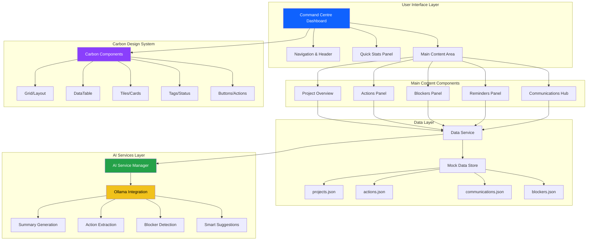
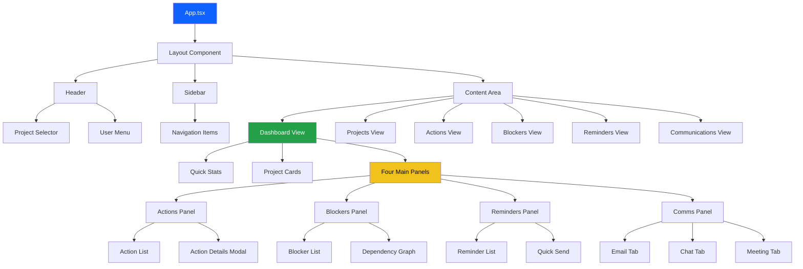
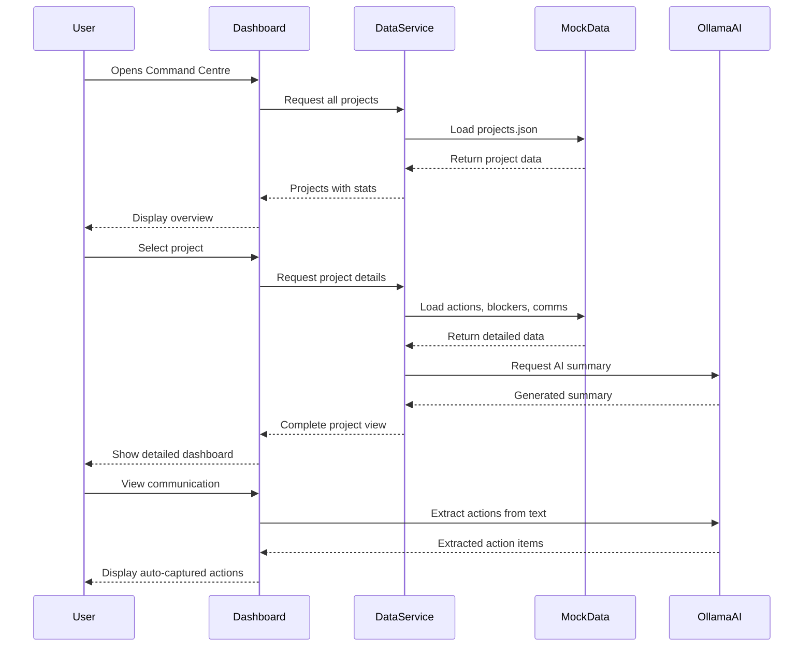
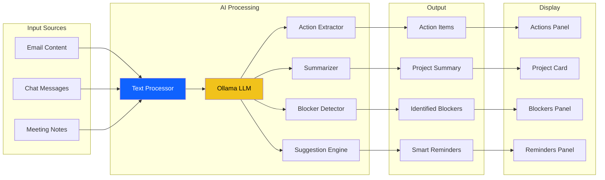
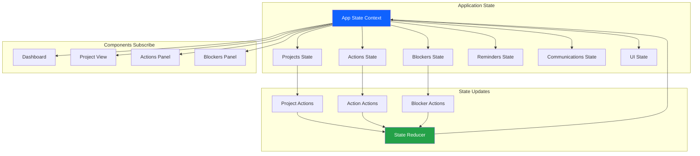
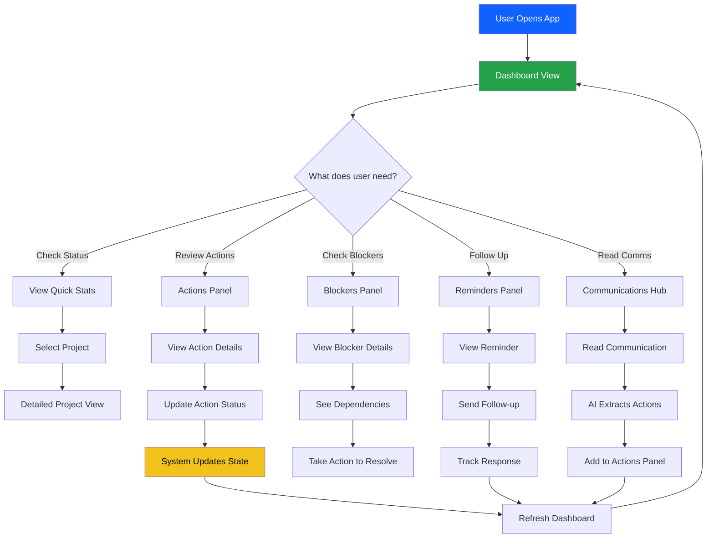
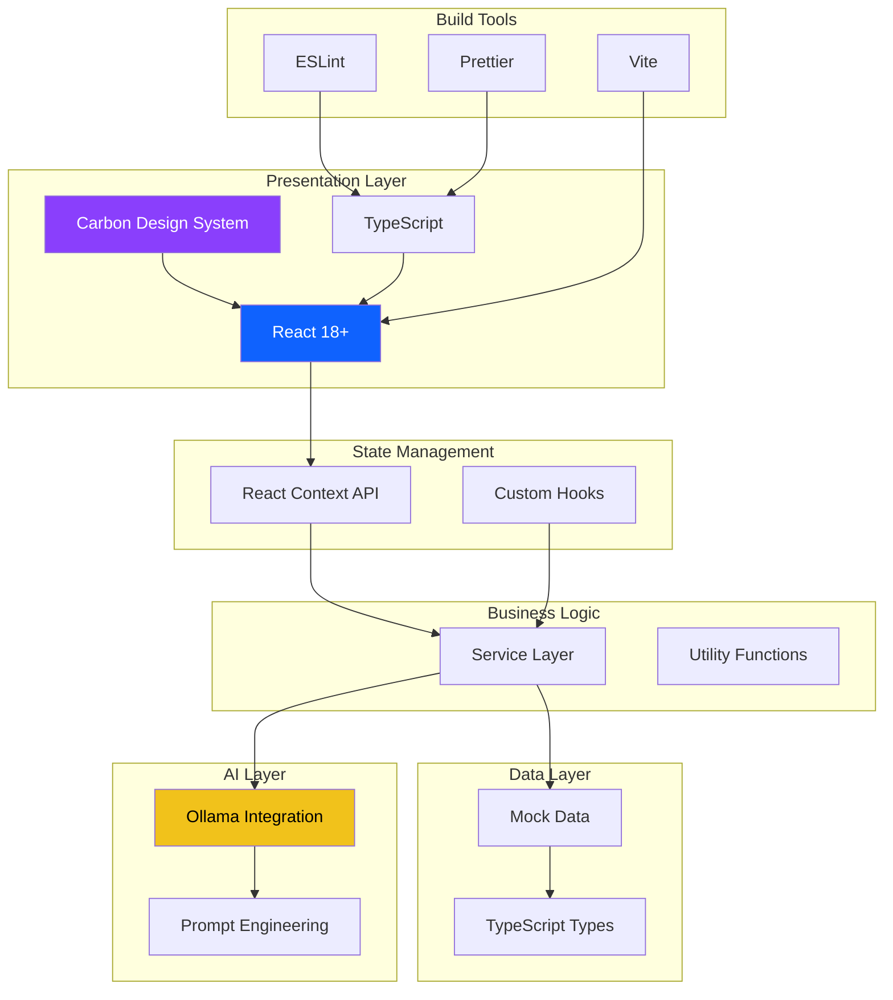
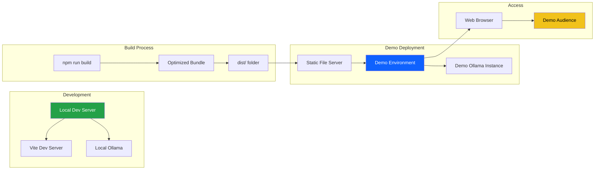

# Kathy's Command Centre - Architecture Overview

## System Architecture

## Component Hierarchy

## Data Flow

## AI Integration Flow

## State Management

## User Journey Flow

## Technology Stack Layers

## Deployment Architecture

## Security & Performance Considerations

```mermaid
graph TB
    subgraph "Performance Optimizations"
        LAZY[Lazy Loading]
        MEMO[React.memo]
        VIRTUAL[Virtualization]
        CACHE[Response Caching]
    end
    
    subgraph "Security Measures"
        SANITIZE[Input Sanitization]
        CSP[Content Security Policy]
        CORS[CORS Configuration]
    end
    
    subgraph "Accessibility"
        A11Y[WCAG 2.1 AA]
        KEYBOARD[Keyboard Navigation]
        SCREEN[Screen Reader Support]
        CONTRAST[High Contrast Mode]
    end
    
    subgraph "Monitoring"
        ERRORS[Error Boundaries]
        LOGGING[Console Logging]
        PERF[Performance Metrics]
    end
    
    LAZY --> APP[Application]
    MEMO --> APP
    VIRTUAL --> APP
    CACHE --> APP
    
    SANITIZE --> APP
    CSP --> APP
    CORS --> APP
    
    A11Y --> APP
    KEYBOARD --> APP
    SCREEN --> APP
    CONTRAST --> APP
    
    ERRORS --> APP
    LOGGING --> APP
    PERF --> APP
    
    style APP fill:#0f62fe,color:#fff
```

---

## Key Design Decisions

### 1. Component Architecture
- **Modular Design**: Each feature is a self-contained component
- **Reusability**: Common components shared across features
- **Separation of Concerns**: UI, logic, and data layers clearly separated

### 2. State Management
- **Context API**: Lightweight, built-in React solution
- **Local State**: Component-level state for UI interactions
- **Derived State**: Computed values from base state

### 3. AI Integration
- **Async Processing**: Non-blocking AI calls
- **Fallback Responses**: Pre-generated content for demo reliability
- **Caching**: Store AI responses to avoid redundant calls

### 4. Data Structure
- **Normalized Data**: Efficient lookups and updates
- **Relationships**: Clear links between projects, actions, blockers
- **Timestamps**: Track creation and updates

### 5. UI/UX Patterns
- **Progressive Disclosure**: Show details on demand
- **Consistent Navigation**: Predictable user flows
- **Visual Hierarchy**: Clear importance indicators
- **Responsive Feedback**: Immediate UI updates

---

**Document Version**: 1.0  
**Last Updated**: 2026-06-04  
**Companion to**: demo-plan.md