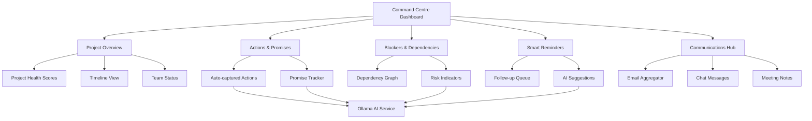

# Kathy's Project Management Command Centre - Demo Plan

## Executive Summary

This plan outlines the development of an interactive demo showcasing an intelligent command centre that solves Kathy's project management challenges. The demo will feature a comprehensive Carbon React-based dashboard that aggregates scattered information, automatically captures actions and promises, surfaces blockers and dependencies, and provides AI-powered insights using Ollama.

---

## 1. Project Overview

### 1.1 Problem Statement
Kathy, a project manager, struggles with:
- Scattered communication across emails, chats, meetings, and ADO
- Manual tracking of actions, promises, and deliverables
- Limited visibility into blockers and dependencies
- Time wasted chasing team members for updates
- Lack of centralized project clarity leading to delays

### 1.2 Solution
An intelligent command centre that provides:
- **Unified View**: All project information in one place
- **Automated Capture**: Actions and promises extracted from communications
- **Proactive Alerts**: Blockers and dependencies surfaced automatically
- **Smart Reminders**: AI-driven follow-up suggestions
- **Real-time Clarity**: Live project health and status

### 1.3 Demo Objectives
- Showcase the transformation from chaos to clarity
- Demonstrate key features through interactive exploration
- Illustrate multiple projects with realistic complexity
- Show AI-powered summaries and action extraction

---

## 2. Technical Architecture

### 2.1 Technology Stack

```
Frontend Framework: React 18+
UI Library: IBM Carbon Design System (@carbon/react)
State Management: React Context API + useState/useReducer
AI Integration: Ollama (local LLM)
Build Tool: Vite
Language: TypeScript
Styling: Carbon Components + Custom CSS
Mock Data: JSON files with realistic project data
```

### 2.2 Project Structure

```
kathy-pm-demo/
├── src/
│   ├── components/
│   │   ├── Dashboard/
│   │   │   ├── CommandCentre.tsx
│   │   │   ├── ProjectOverview.tsx
│   │   │   └── QuickStats.tsx
│   │   ├── Projects/
│   │   │   ├── ProjectCard.tsx
│   │   │   ├── ProjectList.tsx
│   │   │   └── ProjectHealth.tsx
│   │   ├── Actions/
│   │   │   ├── ActionsPanel.tsx
│   │   │   ├── ActionItem.tsx
│   │   │   └── PromiseTracker.tsx
│   │   ├── Blockers/
│   │   │   ├── BlockersPanel.tsx
│   │   │   ├── DependencyGraph.tsx
│   │   │   └── RiskIndicator.tsx
│   │   ├── Reminders/
│   │   │   ├── RemindersPanel.tsx
│   │   │   ├── FollowUpList.tsx
│   │   │   └── SmartSuggestions.tsx
│   │   ├── Communications/
│   │   │   ├── CommsAggregator.tsx
│   │   │   ├── EmailThread.tsx
│   │   │   ├── ChatMessages.tsx
│   │   │   └── MeetingNotes.tsx
│   │   └── Common/
│   │       ├── Header.tsx
│   │       ├── Sidebar.tsx
│   │       └── LoadingState.tsx
│   ├── services/
│   │   ├── ollamaService.ts
│   │   ├── mockDataService.ts
│   │   └── aiSummaryService.ts
│   ├── data/
│   │   ├── projects.json
│   │   ├── actions.json
│   │   ├── communications.json
│   │   └── teamMembers.json
│   ├── types/
│   │   ├── project.types.ts
│   │   ├── action.types.ts
│   │   └── communication.types.ts
│   ├── utils/
│   │   ├── dateHelpers.ts
│   │   └── statusHelpers.ts
│   ├── App.tsx
│   └── main.tsx
├── public/
├── package.json
├── vite.config.ts
├── tsconfig.json
└── README.md
```

### 2.3 System Architecture Diagram



---

## 3. Core Features & Components

### 3.1 Command Centre Dashboard

**Purpose**: Main hub providing 360° project visibility

**Key Elements**:
- Top navigation with project switcher
- Quick stats tiles (active projects, pending actions, blockers, overdue items)
- Four main panels: Actions, Blockers, Reminders, Communications
- Real-time status indicators

**Carbon Components**:
- `Grid`, `Column` for layout
- `Tile` for stat cards
- `Tabs` for panel switching
- `Tag` for status indicators

### 3.2 Project Overview Cards

**Purpose**: High-level view of all projects with health metrics

**Key Elements**:
- Project name, description, and timeline
- Health score (Green/Yellow/Red)
- Progress bar
- Key metrics: completion %, blockers count, team size
- Quick actions (view details, update status)

**Carbon Components**:
- `Tile`, `ClickableTile`
- `ProgressBar`
- `Tag` for health status
- `Button` for actions

### 3.3 Actions & Promises Tracking

**Purpose**: Automatically captured commitments from all communications

**Key Elements**:
- List of action items with owner, due date, source
- Promise tracker showing commitments made/received
- Filter by project, person, status
- Visual indicators for overdue items
- Source links (email, chat, meeting)

**Carbon Components**:
- `DataTable` with sorting/filtering
- `Tag` for status and priority
- `OverflowMenu` for actions
- `Modal` for details

**AI Integration**:
- Ollama extracts action items from meeting notes and emails
- Identifies commitments and assigns owners
- Generates summaries of action context

### 3.4 Blockers & Dependencies

**Purpose**: Surface risks and dependencies before they cause delays

**Key Elements**:
- Active blockers list with severity
- Dependency visualization (who's waiting on whom)
- Risk indicators with AI-detected patterns
- Resolution suggestions

**Carbon Components**:
- `Accordion` for blocker details
- `Tag` for severity levels
- Custom dependency graph visualization
- `InlineNotification` for alerts

**AI Integration**:
- Ollama analyzes communications for blocker keywords
- Detects dependency patterns
- Suggests mitigation strategies

### 3.5 Smart Reminders & Follow-ups

**Purpose**: Proactive nudges to keep projects moving

**Key Elements**:
- Prioritized follow-up queue
- AI-suggested reminder timing
- Quick-send templates
- Response tracking

**Carbon Components**:
- `StructuredList` for reminders
- `Button` for quick actions
- `TextArea` for message composition
- `DatePicker` for scheduling

**AI Integration**:
- Ollama suggests optimal follow-up timing
- Generates personalized reminder messages
- Identifies who needs chasing based on patterns

### 3.6 Communications Aggregator

**Purpose**: Centralize scattered conversations

**Key Elements**:
- Unified inbox showing emails, chats, meeting notes
- Filter by project, person, date
- Search across all communications
- Link to original source

**Carbon Components**:
- `Tabs` for communication types
- `Search` for filtering
- `Tile` for message cards
- `Link` to external sources

**AI Integration**:
- Ollama generates summaries of long threads
- Extracts key points from meetings
- Identifies action items automatically

---

## 4. Mock Data Structure

### 4.1 Projects Data

```typescript
interface Project {
  id: string;
  name: string;
  description: string;
  status: 'on-track' | 'at-risk' | 'delayed';
  health: 'green' | 'yellow' | 'red';
  progress: number; // 0-100
  startDate: string;
  endDate: string;
  team: TeamMember[];
  activeBlockers: number;
  pendingActions: number;
  lastUpdated: string;
}
```

**Demo Projects**:
1. **Business-Critical App Launch** (main focus)
   - Status: at-risk
   - Health: yellow
   - Progress: 65%
   - Team: 12 members (developers, designers, security)
   - Blockers: 3 active
   - Actions: 18 pending

2. **Customer Portal Redesign**
   - Status: on-track
   - Health: green
   - Progress: 80%
   - Team: 8 members
   - Blockers: 1 active
   - Actions: 7 pending

3. **API Integration Project**
   - Status: delayed
   - Health: red
   - Progress: 40%
   - Team: 6 members
   - Blockers: 5 active
   - Actions: 23 pending

### 4.2 Actions Data

```typescript
interface Action {
  id: string;
  projectId: string;
  title: string;
  description: string;
  owner: string;
  dueDate: string;
  status: 'pending' | 'in-progress' | 'completed' | 'overdue';
  priority: 'high' | 'medium' | 'low';
  source: {
    type: 'email' | 'chat' | 'meeting' | 'ado';
    reference: string;
    extractedBy: 'ai' | 'manual';
  };
  createdDate: string;
}
```

### 4.3 Communications Data

```typescript
interface Communication {
  id: string;
  type: 'email' | 'chat' | 'meeting';
  projectId: string;
  subject: string;
  from: string;
  to: string[];
  date: string;
  content: string;
  extractedActions: string[]; // Action IDs
  aiSummary?: string;
  hasBlockers: boolean;
}
```

### 4.4 Blockers Data

```typescript
interface Blocker {
  id: string;
  projectId: string;
  title: string;
  description: string;
  severity: 'critical' | 'high' | 'medium' | 'low';
  blockedBy: string; // Person or external factor
  affectedTasks: string[];
  identifiedDate: string;
  estimatedResolutionDate?: string;
  status: 'active' | 'resolving' | 'resolved';
  dependencies: string[]; // Other blocker IDs
}
```

---

## 5. AI Integration with Ollama

### 5.1 Setup Requirements

```bash
# Install Ollama
curl -fsSL https://ollama.com/install.sh | sh

# Pull a suitable model (e.g., llama2, mistral)
ollama pull llama2
```

### 5.2 AI Service Functions

**Action Extraction**:
```typescript
async function extractActions(text: string): Promise<Action[]> {
  const prompt = `Extract action items from this text. 
  For each action, identify: task, owner, due date.
  Text: ${text}`;
  
  const response = await ollama.generate({
    model: 'llama2',
    prompt: prompt
  });
  
  return parseActionsFromResponse(response);
}
```

**Summary Generation**:
```typescript
async function generateSummary(communications: Communication[]): Promise<string> {
  const prompt = `Summarize these project communications in 2-3 sentences:
  ${communications.map(c => c.content).join('\n\n')}`;
  
  const response = await ollama.generate({
    model: 'llama2',
    prompt: prompt
  });
  
  return response.response;
}
```

**Blocker Detection**:
```typescript
async function detectBlockers(text: string): Promise<Blocker[]> {
  const prompt = `Identify project blockers, risks, or dependencies in this text:
  ${text}`;
  
  const response = await ollama.generate({
    model: 'llama2',
    prompt: prompt
  });
  
  return parseBlockersFromResponse(response);
}
```

### 5.3 AI Features in Demo

1. **Auto-generated Summaries**: Each project shows AI summary of recent activity
2. **Action Extraction**: Demo shows actions being extracted from sample emails/meetings
3. **Smart Suggestions**: AI suggests follow-up messages and timing
4. **Risk Detection**: AI highlights potential risks in communications

---

## 6. User Interface Design

### 6.1 Layout Structure

```
┌─────────────────────────────────────────────────────────┐
│  Header: Kathy's Command Centre | [Project Selector]    │
├─────────────────────────────────────────────────────────┤
│  Quick Stats:  [3 Projects] [24 Actions] [5 Blockers]  │
├──────────────┬──────────────────────────────────────────┤
│              │                                          │
│   Sidebar    │         Main Content Area               │
│              │                                          │
│  - Dashboard │  ┌────────────────────────────────┐    │
│  - Projects  │  │   Project Overview Cards       │    │
│  - Actions   │  └────────────────────────────────┘    │
│  - Blockers  │                                          │
│  - Reminders │  ┌─────────────┬─────────────────┐    │
│  - Comms     │  │  Actions &  │  Blockers &     │    │
│              │  │  Promises   │  Dependencies   │    │
│              │  └─────────────┴─────────────────┘    │
│              │                                          │
│              │  ┌─────────────┬─────────────────┐    │
│              │  │  Smart      │  Communications │    │
│              │  │  Reminders  │  Hub            │    │
│              │  └─────────────┴─────────────────┘    │
└──────────────┴──────────────────────────────────────────┘
```

### 6.2 Color Scheme (Carbon Theme)

- **Primary**: IBM Blue (#0f62fe)
- **Success/Green**: #24a148
- **Warning/Yellow**: #f1c21b
- **Error/Red**: #da1e28
- **Background**: #f4f4f4
- **Surface**: #ffffff
- **Text**: #161616

### 6.3 Key Interactions

1. **Project Switching**: Dropdown in header filters all panels
2. **Action Quick View**: Click action item opens modal with details
3. **Blocker Expansion**: Accordion reveals dependency graph
4. **AI Summary Toggle**: Button to show/hide AI-generated insights
5. **Communication Search**: Real-time filtering across all comms

---

## 7. Demo Scenarios & User Flows

### 7.1 Scenario 1: Morning Check-in

**User Story**: Kathy starts her day and needs to understand project status

**Flow**:
1. Opens Command Centre dashboard
2. Sees quick stats: 3 projects, 24 pending actions, 5 blockers
3. Reviews AI-generated overnight summary
4. Clicks on "Business-Critical App Launch" project
5. Sees health status (yellow - at risk)
6. Reviews 3 active blockers with severity indicators
7. Checks smart reminders: 4 people need follow-up today

**Demo Data**:
- Overnight: 12 new emails, 3 chat messages, 1 meeting note
- AI extracted: 5 new action items
- New blocker detected: Security review delayed

### 7.2 Scenario 2: Action Item Discovery

**User Story**: Kathy reviews a meeting and actions are automatically captured

**Flow**:
1. Navigates to Communications Hub
2. Selects "Meeting Notes" tab
3. Clicks on "Sprint Planning - June 3"
4. AI summary appears at top
5. Sees 6 action items automatically extracted
6. Each action shows: owner, due date, priority
7. Clicks "Add to Actions Panel" for each
8. Actions now appear in main Actions tracker

**Demo Data**:
- Meeting: 45-minute sprint planning with 8 attendees
- AI extracted: 6 actions, 2 blockers, 3 dependencies
- Summary: "Team committed to completing authentication module by June 10. Security review scheduled for June 8. Design team needs API specs by June 5."

### 7.3 Scenario 3: Blocker Management

**User Story**: Kathy identifies and addresses a critical blocker

**Flow**:
1. Dashboard shows alert: "New critical blocker detected"
2. Clicks on Blockers panel
3. Sees "API specs delayed - blocking 3 tasks"
4. Expands blocker to see dependency graph
5. Identifies Sarah (designer) is waiting on Tom (developer)
6. Clicks "Smart Reminder" button
7. AI suggests: "Tom, Sarah needs API specs by EOD for design work. Can you provide an update?"
8. Sends reminder with one click
9. Blocker status updates to "Resolving"

**Demo Data**:
- Blocker: API specs 2 days overdue
- Affected: 3 design tasks, 1 development task
- Dependencies: 2 other tasks waiting on designs
- AI suggestion: Escalate to tech lead if no response in 4 hours

### 7.4 Scenario 4: Multi-Project View

**User Story**: Kathy needs to see status across all projects

**Flow**:
1. Clicks "All Projects" in sidebar
2. Sees 3 project cards with health indicators
3. Business-Critical App: Yellow (at risk)
4. Customer Portal: Green (on track)
5. API Integration: Red (delayed)
6. Clicks on API Integration project
7. Sees 5 active blockers, 23 pending actions
8. Reviews AI recommendation: "Consider resource reallocation from Customer Portal project"

**Demo Data**:
- Total team: 26 people across 3 projects
- Overall health: 2 projects need attention
- Cross-project dependency: API Integration blocking App Launch
- AI insight: "Customer Portal ahead of schedule - 2 developers available for reallocation"

---

## 8. Implementation Phases

### Phase 1: Foundation (Days 1-2)
- Set up React + Vite + TypeScript project
- Install Carbon React components
- Create basic project structure
- Set up routing and navigation
- Implement main layout with header and sidebar

### Phase 2: Mock Data & Services (Days 3-4)
- Create comprehensive mock data for 3 projects
- Build data service layer
- Implement state management
- Create TypeScript interfaces
- Set up Ollama integration

### Phase 3: Core Components (Days 5-8)
- Build Dashboard component
- Implement Project Overview cards
- Create Actions & Promises panel
- Build Blockers & Dependencies panel
- Implement Smart Reminders panel
- Create Communications Hub

### Phase 4: AI Integration (Days 9-10)
- Connect Ollama service
- Implement action extraction
- Add summary generation
- Build blocker detection
- Create smart suggestions

### Phase 5: Interactivity & Polish (Days 11-12)
- Add interactive navigation
- Implement filtering and search
- Create modal dialogs
- Add loading states and transitions
- Implement responsive design

### Phase 6: Demo Scenarios (Day 13)
- Create preset demo scenarios
- Add guided tour functionality
- Implement scenario switching
- Test all user flows

### Phase 7: Documentation & Deployment (Day 14)
- Write README with setup instructions
- Document component architecture
- Create demo script
- Build for production
- Test deployment

---

## 9. Success Criteria

### 9.1 Functional Requirements
- ✅ Display 3 projects with realistic data
- ✅ Show automated action capture from communications
- ✅ Surface blockers and dependencies visually
- ✅ Provide smart reminders and follow-ups
- ✅ Aggregate communications from multiple sources
- ✅ Generate AI summaries using Ollama
- ✅ Enable interactive navigation between views
- ✅ Support filtering and search

### 9.2 User Experience Requirements
- ✅ Intuitive navigation with clear information hierarchy
- ✅ Responsive design works on desktop and tablet
- ✅ Fast load times (<2 seconds)
- ✅ Smooth transitions and interactions
- ✅ Accessible (WCAG 2.1 AA compliant via Carbon)
- ✅ Clear visual indicators for status and priority

### 9.3 Demo Requirements
- ✅ Tells Kathy's story effectively
- ✅ Shows transformation from chaos to clarity
- ✅ Demonstrates AI capabilities
- ✅ Runs smoothly without technical issues
- ✅ Can be presented in 10-15 minutes
- ✅ Allows for interactive exploration

---

## 10. Technical Considerations

### 10.1 Performance
- Lazy load components for faster initial render
- Virtualize long lists (actions, communications)
- Optimize AI calls with caching
- Use React.memo for expensive components

### 10.2 Scalability
- Modular component architecture
- Reusable service layer
- Extensible data models
- Plugin-ready AI integration

### 10.3 Accessibility
- Carbon components are WCAG compliant
- Semantic HTML structure
- Keyboard navigation support
- Screen reader friendly
- High contrast mode support

### 10.4 Browser Support
- Chrome 90+
- Firefox 88+
- Safari 14+
- Edge 90+

---

## 11. Risks & Mitigations

### 11.1 Technical Risks

**Risk**: Ollama integration complexity
- **Mitigation**: Start with simple prompts, use fallback mock responses
- **Backup**: Pre-generate AI responses for demo

**Risk**: Carbon React learning curve
- **Mitigation**: Use Carbon documentation and examples
- **Backup**: Use standard React components if needed

**Risk**: Mock data realism
- **Mitigation**: Base on real project management scenarios
- **Backup**: Consult with actual PMs for validation

### 11.2 Demo Risks

**Risk**: AI responses too slow during demo
- **Mitigation**: Pre-cache common responses
- **Backup**: Use loading states and pre-generated content

**Risk**: Complex UI overwhelming for audience
- **Mitigation**: Guided tour mode with highlights
- **Backup**: Simplified view option

---

## 12. Future Enhancements

### Post-Demo Improvements
1. **Real Integrations**: Connect to actual ADO, Slack, Outlook
2. **Advanced AI**: Predictive analytics, sentiment analysis
3. **Mobile App**: Native iOS/Android versions
4. **Collaboration**: Real-time multi-user support
5. **Customization**: User-configurable dashboards
6. **Reporting**: Export capabilities and analytics
7. **Notifications**: Push notifications for critical updates
8. **Voice Interface**: Voice commands for hands-free operation

---

## 13. Resources & References

### Documentation
- [Carbon Design System](https://carbondesignsystem.com/)
- [Ollama Documentation](https://ollama.ai/docs)
- [React Documentation](https://react.dev/)
- [TypeScript Handbook](https://www.typescriptlang.org/docs/)

### Design Inspiration
- Project management tools: Asana, Monday.com, Jira
- Command centres: Mission control dashboards
- AI assistants: GitHub Copilot, ChatGPT interfaces

### Team Contacts
- Product Owner: [Name]
- UX Designer: [Name]
- Tech Lead: [Name]
- Stakeholders: [Names]

---

## 14. Next Steps

1. **Review & Approval**: Present this plan to stakeholders
2. **Environment Setup**: Configure development environment
3. **Kickoff**: Begin Phase 1 implementation
4. **Daily Standups**: Track progress against timeline
5. **Mid-point Review**: Demo progress at Day 7
6. **Final Review**: Complete demo walkthrough at Day 13
7. **Launch**: Present to stakeholders on Day 14

---

## Appendix A: Component Specifications

### A.1 CommandCentre Component

```typescript
interface CommandCentreProps {
  selectedProject?: string;
  onProjectChange: (projectId: string) => void;
}

interface CommandCentreState {
  projects: Project[];
  actions: Action[];
  blockers: Blocker[];
  reminders: Reminder[];
  communications: Communication[];
  loading: boolean;
}
```

### A.2 ProjectCard Component

```typescript
interface ProjectCardProps {
  project: Project;
  onClick: () => void;
  showDetails?: boolean;
}
```

### A.3 ActionsPanel Component

```typescript
interface ActionsPanelProps {
  projectId?: string;
  actions: Action[];
  onActionUpdate: (actionId: string, updates: Partial<Action>) => void;
  onActionComplete: (actionId: string) => void;
}
```

---

## Appendix B: API Endpoints (Mock)

```typescript
// Mock API structure for future real integration
interface MockAPI {
  // Projects
  getProjects(): Promise<Project[]>;
  getProject(id: string): Promise<Project>;
  updateProject(id: string, updates: Partial<Project>): Promise<Project>;
  
  // Actions
  getActions(projectId?: string): Promise<Action[]>;
  createAction(action: Omit<Action, 'id'>): Promise<Action>;
  updateAction(id: string, updates: Partial<Action>): Promise<Action>;
  
  // Blockers
  getBlockers(projectId?: string): Promise<Blocker[]>;
  resolveBlocker(id: string): Promise<void>;
  
  // Communications
  getCommunications(projectId?: string): Promise<Communication[]>;
  
  // AI Services
  generateSummary(text: string): Promise<string>;
  extractActions(text: string): Promise<Action[]>;
  detectBlockers(text: string): Promise<Blocker[]>;
  suggestFollowUp(context: any): Promise<string>;
}
```

---

## Appendix C: Demo Script

### Opening (2 minutes)
"Meet Kathy, a project manager struggling with scattered information, missed commitments, and constant firefighting. Let me show you her typical day..."

### Problem Demonstration (3 minutes)
- Show cluttered email inbox
- Display disconnected chat messages
- Reveal missed action items in meeting notes
- Highlight invisible blockers

### Solution Introduction (2 minutes)
"Now, let's see how the Command Centre transforms Kathy's experience..."

### Feature Walkthrough (6 minutes)
1. Dashboard overview (1 min)
2. Automated action capture (1.5 min)
3. Blocker surfacing (1.5 min)
4. Smart reminders (1 min)
5. Communications hub (1 min)

### Impact Summary (2 minutes)
- Time saved: 5-8 hours per week
- Visibility: 100% of commitments tracked
- Proactive: Blockers caught early
- Confidence: Always prepared for meetings

### Q&A (5 minutes)
Interactive exploration based on audience questions

---

**Document Version**: 1.0  
**Last Updated**: 2026-06-04  
**Status**: Ready for Review