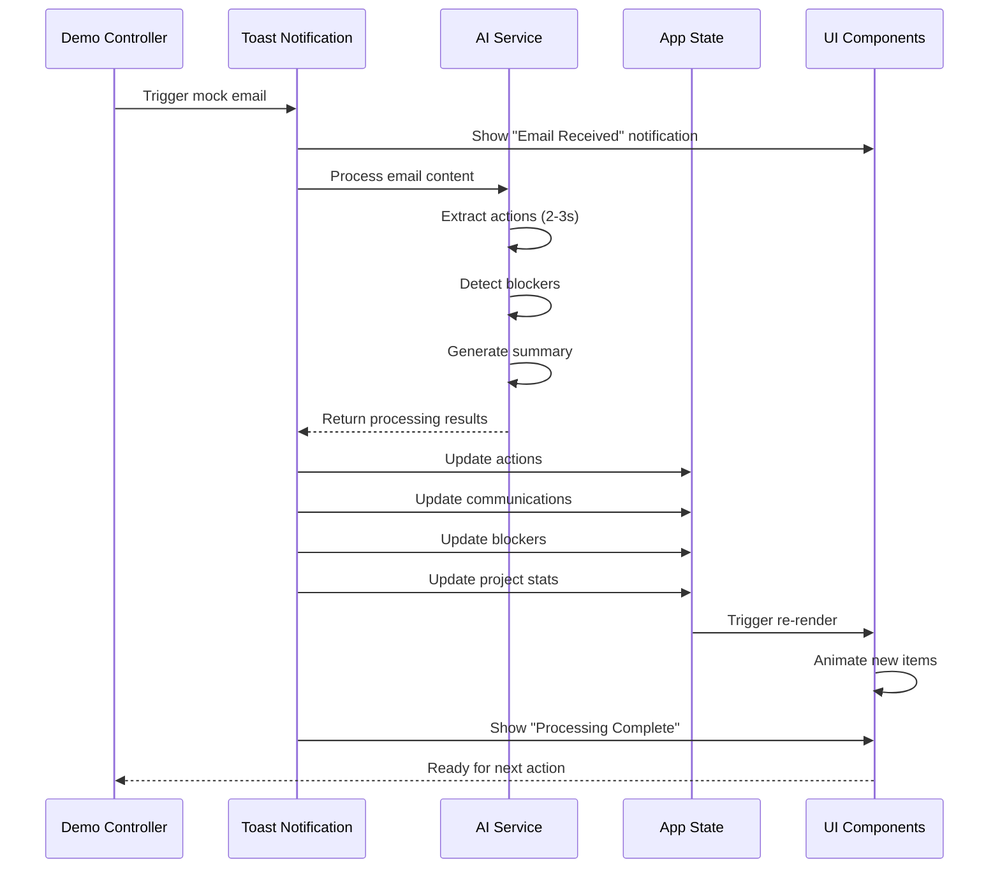

# Live Notification Feature - Real-time Email Processing Demo

## Overview

This feature adds a powerful "wow moment" to the demo by simulating a real-time email notification that demonstrates the system's intelligent automation capabilities. During the demo, Kathy will receive a mock email notification that triggers automatic processing, summarization, and updates across multiple panels.

---

## Feature Description

### What Happens

1. **Notification Appears**: A Carbon toast notification slides in from the top-right
2. **Email Preview**: Shows sender, subject, and snippet
3. **AI Processing**: Visual indicator shows AI analyzing the email
4. **Automatic Updates**: Multiple panels update simultaneously:
   - New action items appear in Actions Panel
   - Communication added to Communications Hub
   - Project stats update (pending actions count increases)
   - AI summary generated and displayed
   - If blockers detected, Blockers Panel updates

### User Experience

```
[Toast Notification appears]
┌─────────────────────────────────────────────┐
│ 📧 New Email Received                       │
│ From: Tom Wilson (Developer)                │
│ Subject: API Integration Update             │
│                                             │
│ AI is processing this email...             │
│ [Progress indicator]                        │
└─────────────────────────────────────────────┘

[After 2-3 seconds]
┌─────────────────────────────────────────────┐
│ ✅ Email Processed                          │
│ • 2 action items extracted                  │
│ • 1 blocker identified                      │
│ • Summary generated                         │
│                                             │
│ [View Details] [Dismiss]                    │
└─────────────────────────────────────────────┘
```

---

## Technical Implementation

### Component Structure

```typescript
// components/Notifications/LiveEmailNotification.tsx
interface EmailNotification {
  id: string;
  from: string;
  subject: string;
  preview: string;
  timestamp: string;
  projectId: string;
  fullContent: string;
}

interface ProcessingResult {
  actions: Action[];
  blockers: Blocker[];
  summary: string;
  hasUrgentItems: boolean;
}
```

### Notification Flow



### Carbon Components Used

```tsx
import { 
  ToastNotification, 
  InlineLoading,
  Button 
} from '@carbon/react';
import { Email, Checkmark } from '@carbon/icons-react';

// Processing state
<ToastNotification
  kind="info"
  title="New Email Received"
  subtitle={`From: ${email.from}`}
  caption={email.subject}
  timeout={0}
  lowContrast
>
  <InlineLoading description="AI is processing this email..." />
</ToastNotification>

// Complete state
<ToastNotification
  kind="success"
  title="Email Processed"
  subtitle="Updates applied to your dashboard"
  caption={`${results.actions.length} actions • ${results.blockers.length} blockers`}
  timeout={5000}
  lowContrast
>
  <Button size="sm" onClick={handleViewDetails}>
    View Details
  </Button>
</ToastNotification>
```

---

## Mock Email Content

### Sample Email for Demo

```typescript
const mockEmail: EmailNotification = {
  id: 'email-demo-001',
  from: 'Tom Wilson <tom.wilson@company.com>',
  subject: 'API Integration Update - Security Review Needed',
  preview: 'Hi Kathy, I wanted to update you on the API integration progress...',
  timestamp: new Date().toISOString(),
  projectId: 'proj-001', // Business-Critical App Launch
  fullContent: `
Hi Kathy,

I wanted to update you on the API integration progress. We've completed the 
authentication module and it's ready for testing.

However, we've hit a blocker - the security team needs to review our OAuth 
implementation before we can proceed with the payment gateway integration. 
I've reached out to Sarah from Security, but haven't heard back yet.

Action items:
1. I'll complete the API documentation by end of day Thursday
2. Need you to follow up with Security team for review scheduling
3. Once approved, I can start the payment gateway work (estimated 3 days)

The good news is we're still on track for the June 15 milestone if we can 
get the security review done by early next week.

Let me know if you need any clarification.

Thanks,
Tom
  `
};
```

### AI Processing Results

```typescript
const processingResults: ProcessingResult = {
  actions: [
    {
      id: 'act-new-001',
      projectId: 'proj-001',
      title: 'Complete API documentation',
      description: 'Finish documentation for authentication module',
      owner: 'Tom Wilson',
      dueDate: '2026-06-06', // Thursday
      status: 'pending',
      priority: 'high',
      source: {
        type: 'email',
        reference: 'email-demo-001',
        extractedBy: 'ai'
      },
      createdDate: new Date().toISOString()
    },
    {
      id: 'act-new-002',
      projectId: 'proj-001',
      title: 'Schedule security review with Sarah',
      description: 'Follow up with Security team for OAuth implementation review',
      owner: 'Kathy Manager',
      dueDate: '2026-06-05', // Tomorrow
      status: 'pending',
      priority: 'high',
      source: {
        type: 'email',
        reference: 'email-demo-001',
        extractedBy: 'ai'
      },
      createdDate: new Date().toISOString()
    }
  ],
  blockers: [
    {
      id: 'block-new-001',
      projectId: 'proj-001',
      title: 'Security review pending for OAuth implementation',
      description: 'Payment gateway integration blocked pending security team review',
      severity: 'high',
      blockedBy: 'Security Team (Sarah)',
      affectedTasks: ['Payment Gateway Integration'],
      identifiedDate: new Date().toISOString(),
      status: 'active',
      dependencies: []
    }
  ],
  summary: 'Tom completed authentication module and needs security review before proceeding with payment gateway. Two action items assigned: API documentation (Tom, Thu) and security review scheduling (Kathy, tomorrow). Project still on track for June 15 if review happens next week.',
  hasUrgentItems: true
};
```

---

## Demo Scenario Integration

### Scenario 5: Live Email Processing (NEW)

**Timing**: 2-3 minutes into demo, after showing dashboard overview

**Setup**:
- Kathy is viewing the Business-Critical App Launch project
- Dashboard shows current stats: 18 pending actions, 3 blockers
- Demo presenter says: "Now let's see what happens when Kathy receives a new email..."

**Flow**:
1. **Trigger** (0:00): Click "Simulate Email" button (hidden in demo mode)
2. **Notification** (0:01): Toast appears with email preview
3. **Processing** (0:02-0:04): Loading indicator shows AI working
4. **Results** (0:05): Success notification with summary
5. **Updates** (0:06-0:10): Highlight changes across panels:
   - Actions Panel: 2 new items appear with animation
   - Stats: "18 pending actions" → "20 pending actions"
   - Blockers Panel: New blocker badge appears
   - Communications Hub: Email added to inbox
   - AI Summary: Displayed in project overview

**Presenter Script**:
```
"Watch what happens when Kathy receives an email from Tom, 
one of her developers...

[Notification appears]

The system immediately recognizes this is project-related 
and starts processing it with AI...

[Processing indicator]

In just a few seconds, the AI has:
- Extracted 2 action items
- Identified 1 blocker
- Generated a summary
- Updated all relevant panels

[Point to each update]

Notice how Kathy doesn't need to manually read the email, 
create tasks, or update her tracking system. It's all 
done automatically, and she can see at a glance what 
needs her attention.

This is the power of intelligent automation."
```

---

## UI/UX Details

### Animation Sequence

```css
/* New item appears with slide-in animation */
@keyframes slideInFromRight {
  from {
    transform: translateX(100%);
    opacity: 0;
  }
  to {
    transform: translateX(0);
    opacity: 1;
  }
}

.new-action-item {
  animation: slideInFromRight 0.5s ease-out;
  background-color: #e5f6ff; /* Light blue highlight */
  border-left: 4px solid #0f62fe; /* IBM Blue */
}

/* Highlight fades after 3 seconds */
@keyframes fadeHighlight {
  from {
    background-color: #e5f6ff;
  }
  to {
    background-color: transparent;
  }
}

.new-item-highlight {
  animation: fadeHighlight 3s ease-out 3s forwards;
}
```

### Visual Indicators

1. **New Badge**: Small "NEW" tag on newly added items
2. **Pulse Effect**: Subtle pulse on updated stat numbers
3. **Highlight**: Temporary background color on new items
4. **Icon**: Email icon next to items extracted from email
5. **Timestamp**: "Just now" indicator on new items

---

## Implementation Code Samples

### Demo Controller

```typescript
// services/demoController.ts
export class DemoController {
  private notificationTimeout: NodeJS.Timeout | null = null;
  
  async triggerLiveEmail(
    email: EmailNotification,
    onUpdate: (results: ProcessingResult) => void
  ): Promise<void> {
    // Show initial notification
    this.showNotification('processing', email);
    
    // Simulate AI processing (2-3 seconds)
    await this.delay(2500);
    
    // Process email with AI
    const results = await this.processEmail(email);
    
    // Show success notification
    this.showNotification('success', email, results);
    
    // Update app state
    onUpdate(results);
    
    // Highlight new items
    this.highlightNewItems(results);
  }
  
  private async processEmail(email: EmailNotification): Promise<ProcessingResult> {
    // In demo, use pre-generated results for reliability
    // In production, would call Ollama API
    return mockProcessingResults;
  }
  
  private highlightNewItems(results: ProcessingResult): void {
    // Add temporary highlight class to new items
    results.actions.forEach(action => {
      const element = document.querySelector(`[data-action-id="${action.id}"]`);
      element?.classList.add('new-item-highlight');
    });
  }
  
  private delay(ms: number): Promise<void> {
    return new Promise(resolve => setTimeout(resolve, ms));
  }
}
```

### Notification Component

```typescript
// components/Notifications/LiveEmailNotification.tsx
import React, { useState, useEffect } from 'react';
import { ToastNotification, InlineLoading, Button } from '@carbon/react';
import { Email, Checkmark } from '@carbon/icons-react';

interface Props {
  email: EmailNotification;
  results?: ProcessingResult;
  status: 'processing' | 'success' | 'error';
  onViewDetails?: () => void;
  onDismiss?: () => void;
}

export const LiveEmailNotification: React.FC<Props> = ({
  email,
  results,
  status,
  onViewDetails,
  onDismiss
}) => {
  if (status === 'processing') {
    return (
      <ToastNotification
        kind="info"
        title="New Email Received"
        subtitle={`From: ${email.from}`}
        caption={email.subject}
        timeout={0}
        lowContrast
        hideCloseButton
      >
        <div style={{ marginTop: '1rem' }}>
          <InlineLoading description="AI is processing this email..." />
        </div>
      </ToastNotification>
    );
  }
  
  if (status === 'success' && results) {
    return (
      <ToastNotification
        kind="success"
        title="Email Processed"
        subtitle="Updates applied to your dashboard"
        caption={`${results.actions.length} actions • ${results.blockers.length} blockers • Summary generated`}
        timeout={5000}
        onClose={onDismiss}
        lowContrast
      >
        <div style={{ marginTop: '1rem', display: 'flex', gap: '0.5rem' }}>
          <Button size="sm" onClick={onViewDetails}>
            View Details
          </Button>
          <Button size="sm" kind="ghost" onClick={onDismiss}>
            Dismiss
          </Button>
        </div>
      </ToastNotification>
    );
  }
  
  return null;
};
```

### State Update Handler

```typescript
// App.tsx or context
const handleEmailProcessed = (results: ProcessingResult) => {
  // Add new actions
  dispatch({
    type: 'ADD_ACTIONS',
    payload: results.actions
  });
  
  // Add new blockers
  dispatch({
    type: 'ADD_BLOCKERS',
    payload: results.blockers
  });
  
  // Add email to communications
  dispatch({
    type: 'ADD_COMMUNICATION',
    payload: {
      ...mockEmail,
      extractedActions: results.actions.map(a => a.id),
      aiSummary: results.summary,
      hasBlockers: results.blockers.length > 0
    }
  });
  
  // Update project stats
  dispatch({
    type: 'UPDATE_PROJECT_STATS',
    payload: {
      projectId: mockEmail.projectId,
      pendingActions: state.actions.filter(a => a.status === 'pending').length + results.actions.length,
      activeBlockers: state.blockers.filter(b => b.status === 'active').length + results.blockers.length
    }
  });
  
  // Trigger animations
  setTimeout(() => {
    highlightNewItems(results);
  }, 100);
};
```

---

## Demo Control Panel

### Hidden Demo Controls

```typescript
// components/Demo/DemoControls.tsx
// Only visible in demo mode (activated by keyboard shortcut)

interface DemoControlsProps {
  onTriggerEmail: () => void;
  onResetDemo: () => void;
  onSkipToScenario: (scenarioId: string) => void;
}

export const DemoControls: React.FC<DemoControlsProps> = ({
  onTriggerEmail,
  onResetDemo,
  onSkipToScenario
}) => {
  const [isVisible, setIsVisible] = useState(false);
  
  useEffect(() => {
    const handleKeyPress = (e: KeyboardEvent) => {
      // Ctrl+Shift+D to toggle demo controls
      if (e.ctrlKey && e.shiftKey && e.key === 'D') {
        setIsVisible(!isVisible);
      }
    };
    
    window.addEventListener('keydown', handleKeyPress);
    return () => window.removeEventListener('keydown', handleKeyPress);
  }, [isVisible]);
  
  if (!isVisible) return null;
  
  return (
    <div className="demo-controls">
      <h4>Demo Controls</h4>
      <Button onClick={onTriggerEmail}>
        Trigger Live Email
      </Button>
      <Button onClick={onResetDemo}>
        Reset Demo
      </Button>
      <Select
        id="scenario-select"
        labelText="Jump to Scenario"
        onChange={(e) => onSkipToScenario(e.target.value)}
      >
        <SelectItem value="1" text="Morning Check-in" />
        <SelectItem value="2" text="Action Discovery" />
        <SelectItem value="3" text="Blocker Management" />
        <SelectItem value="4" text="Multi-Project View" />
        <SelectItem value="5" text="Live Email" />
      </Select>
    </div>
  );
};
```

---

## Testing Checklist

### Functional Tests
- [ ] Notification appears on trigger
- [ ] Processing indicator shows for 2-3 seconds
- [ ] Success notification displays results
- [ ] Actions Panel updates with new items
- [ ] Blockers Panel updates if blockers detected
- [ ] Communications Hub shows new email
- [ ] Project stats update correctly
- [ ] AI summary generates and displays
- [ ] "View Details" button navigates correctly
- [ ] Dismiss button closes notification

### Visual Tests
- [ ] New items have highlight animation
- [ ] Highlight fades after 3 seconds
- [ ] "NEW" badges appear on items
- [ ] Stat numbers pulse on update
- [ ] Email icon shows on extracted items
- [ ] Timestamp shows "Just now"
- [ ] Notification doesn't block important UI
- [ ] Animations are smooth (60fps)

### Demo Tests
- [ ] Can trigger multiple times
- [ ] Works in all demo scenarios
- [ ] Timing is appropriate for presentation
- [ ] Presenter can control timing
- [ ] Fallback works if AI is slow
- [ ] Reset function clears all updates

---

## Benefits for Demo

### Why This Feature is Powerful

1. **Visual Impact**: Immediate, tangible demonstration of automation
2. **Real-time Feel**: Shows system is "alive" and working
3. **Multiple Updates**: Demonstrates integration across panels
4. **AI Showcase**: Highlights AI capabilities in action
5. **Relatable**: Everyone understands email overload
6. **Wow Factor**: Unexpected, impressive moment in demo

### Presenter Talking Points

- "This is what makes Kathy's life easier - no manual data entry"
- "Notice how the system understands context and relationships"
- "The AI extracted action items, identified blockers, and updated everything automatically"
- "Kathy can now focus on decision-making instead of data management"
- "This happens for every email, chat, and meeting - imagine the time saved"

---

## Future Enhancements

### Post-Demo Improvements

1. **Multiple Email Types**: Different scenarios (urgent, FYI, approval needed)
2. **Batch Processing**: Show multiple emails processed at once
3. **Smart Routing**: Emails auto-assigned to relevant projects
4. **Priority Detection**: AI identifies urgent items
5. **Sentiment Analysis**: Detect frustration or concerns in communications
6. **Follow-up Suggestions**: AI recommends immediate actions
7. **Calendar Integration**: Auto-schedule meetings mentioned in emails
8. **Conflict Detection**: Identify scheduling or resource conflicts

---

## Implementation Priority

**Phase**: 3.5 (Between Core Components and AI Integration)

**Rationale**: 
- Requires core components to be built first
- Needs AI service to be functional
- Should be added before final polish
- Critical for demo impact

**Estimated Time**: 1-2 days
- Day 1: Build notification component and demo controller
- Day 2: Integrate with existing panels, add animations, test

---

## Success Criteria

The live notification feature will be successful if:
- ✅ Notification appears smoothly without jarring the demo
- ✅ Processing time feels realistic (not too fast or slow)
- ✅ All panels update correctly and visibly
- ✅ Animations enhance rather than distract
- ✅ Presenter can control timing
- ✅ Audience reacts positively ("wow" moment)
- ✅ Feature is reliable and doesn't break demo flow

---

**Document Version**: 1.0  
**Created**: 2026-06-04  
**Status**: Ready for Implementation  
**Priority**: High (Critical for Demo Impact)