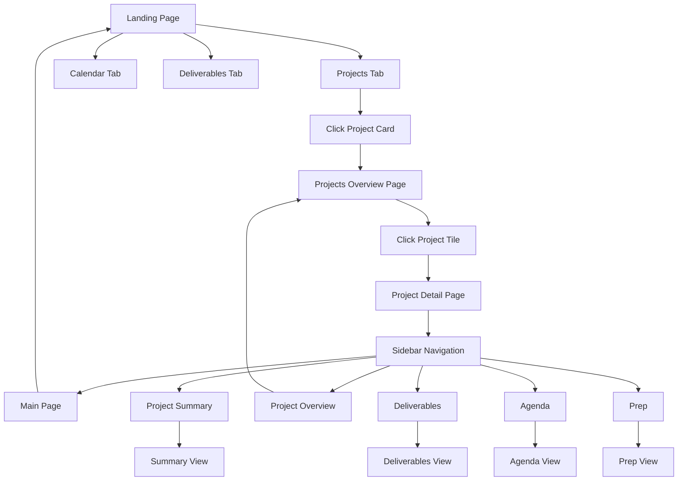

# Kathy's Command Centre - Redesign Implementation Plan

## Overview
This plan outlines the modifications to Kathy's Command Centre to include a new landing page, enhanced navigation structure, and reorganized content sections.

---

## 1. Architecture Changes

### 1.1 Current Structure
```
App.tsx
└── CommandCentre (Dashboard)
    ├── Header
    ├── QuickStats
    ├── ProjectOverview
    └── Tabs (Actions, Blockers, Reminders, Communications)
```

### 1.2 New Structure
```
App.tsx (with routing)
├── LandingPage (NEW - Entry point)
│   ├── UserProfile (photo/icon)
│   └── Tabs
│       ├── Projects Tab
│       ├── Calendar Tab
│       └── Deliverables Tab
│
└── MainApp (with Sidebar)
    ├── Sidebar Navigation (NEW)
    │   ├── Main Page
    │   ├── Project Summary
    │   ├── Project Overview
    │   ├── Deliverables
    │   ├── Agenda
    │   └── Prep
    │
    └── Content Area (route-based)
        ├── ProjectsOverviewPage (NEW)
        ├── ProjectDetailPage (enhanced CommandCentre)
        ├── ProjectSummaryPage (NEW)
        ├── DeliverablesPage (NEW)
        ├── AgendaPage (NEW)
        └── PrepPage (NEW)
```

---

## 2. Component Specifications

### 2.1 LandingPage Component

**Location**: `src/components/Landing/LandingPage.tsx`

**Features**:
- User profile section with photo/icon placeholder
- Welcome message: "Welcome, Kathy"
- Three main tabs at the bottom of the page
- Clean, centered layout

**Tabs Content**:

#### Projects Tab
- Grid of 3 project cards (existing projects)
- Each card shows: name, health status, progress bar
- Clickable to navigate to ProjectsOverviewPage

#### Calendar Tab
- Weekly calendar view
- Meetings for the week
- Today's actions
- Active reminders
- Uses existing actions and reminders data

#### Deliverables Tab
- Communications hub (emails, chats, meetings)
- Project actions grouped by project
- Uses existing communications and actions data

**Carbon Components**:
- `Tile` for user profile section
- `Tabs`, `TabList`, `Tab`, `TabPanels`, `TabPanel`
- `Grid`, `Column` for layout
- `Button` for navigation

---

### 2.2 Sidebar Navigation Component

**Location**: `src/components/Navigation/Sidebar.tsx`

**Features**:
- Fixed left sidebar (visible on all pages except landing)
- Navigation items with icons
- Active state highlighting
- Responsive collapse/expand

**Navigation Items**:
1. **Main Page** - Returns to landing page
2. **Project Summary** - AI-generated project summaries
3. **Project Overview** - Detailed project cards view
4. **Deliverables** - All deliverables across projects
5. **Agenda** - Meeting agenda and schedule
6. **Prep** - Meeting preparation materials

**Carbon Components**:
- `SideNav`, `SideNavItems`, `SideNavLink`
- Icons from `@carbon/icons-react`

---

### 2.3 ProjectsOverviewPage Component

**Location**: `src/components/Projects/ProjectsOverviewPage.tsx`

**Features**:
- Grid layout with 3 rectangular project cards
- Each card is a clickable icon/tile
- Shows project name and key metrics
- Navigates to detailed project view on click

**Project Cards**:
1. Business-Critical App Launch
2. Customer Portal Redesign
3. API Integration Project

**Carbon Components**:
- `ClickableTile`
- `Grid`, `Column`
- `Tag` for status
- Icons for visual representation

---

### 2.4 Calendar Tab Content

**Features**:
- Weekly calendar grid (Monday-Sunday)
- Meeting cards with time, title, attendees
- Today's actions list
- Active reminders panel

**Mock Data Structure**:
```typescript
interface Meeting {
  id: string;
  title: string;
  date: string;
  startTime: string;
  endTime: string;
  attendees: string[];
  projectId: string;
  location: string;
}
```

**Carbon Components**:
- `StructuredList` for meetings
- `Tile` for daily actions
- `Tag` for time indicators

---

### 2.5 Deliverables Tab Content

**Features**:
- Communications aggregator
- Project actions grouped by project
- Filter by project
- Search functionality

**Sections**:
1. **Communications** - Recent emails, chats, meeting notes
2. **Project A Actions** - Actions for Business-Critical App
3. **Project B Actions** - Actions for Customer Portal
4. **Project C Actions** - Actions for API Integration

**Carbon Components**:
- `Accordion` for project grouping
- `DataTable` for actions
- `Search` for filtering

---

### 2.6 Additional Page Components

#### ProjectSummaryPage
- AI-generated summaries for each project
- Key metrics and health indicators
- Recent activity timeline

#### AgendaPage
- Upcoming meetings
- Meeting agendas
- Action items per meeting

#### PrepPage
- Meeting preparation checklist
- Required materials
- Pre-meeting briefings

---

## 3. Routing Implementation

### 3.1 Install React Router
```bash
npm install react-router-dom
```

### 3.2 Route Structure
```typescript
<Routes>
  <Route path="/" element={<LandingPage />} />
  <Route path="/app" element={<MainAppLayout />}>
    <Route path="projects" element={<ProjectsOverviewPage />} />
    <Route path="projects/:projectId" element={<ProjectDetailPage />} />
    <Route path="summary" element={<ProjectSummaryPage />} />
    <Route path="deliverables" element={<DeliverablesPage />} />
    <Route path="agenda" element={<AgendaPage />} />
    <Route path="prep" element={<PrepPage />} />
  </Route>
</Routes>
```

---

## 4. Data Structure Updates

### 4.1 New Mock Data Files

#### meetings.json
```json
[
  {
    "id": "meet-001",
    "title": "Sprint Planning",
    "date": "2026-06-05",
    "startTime": "09:00",
    "endTime": "10:30",
    "attendees": ["Sarah Chen", "Tom Wilson", "Maria Garcia"],
    "projectId": "proj-001",
    "location": "Conference Room A"
  }
]
```

#### agenda.json
```json
[
  {
    "id": "agenda-001",
    "meetingId": "meet-001",
    "items": [
      "Review sprint goals",
      "Assign tasks",
      "Discuss blockers"
    ]
  }
]
```

---

## 5. Styling Guidelines

### 5.1 Landing Page Styles
- Centered layout with max-width: 1200px
- User profile section: 200px circular avatar
- Tab content: Full width with padding
- Smooth transitions between tabs

### 5.2 Sidebar Styles
- Fixed width: 256px
- Background: Carbon UI background
- Active item: Blue highlight
- Hover effects on navigation items

### 5.3 Project Cards
- Rectangular tiles: 300px x 200px
- Grid gap: 2rem
- Hover effect: Slight elevation
- Click feedback: Scale animation

---

## 6. Implementation Sequence

### Phase 1: Foundation (Steps 1-3)
1. Install react-router-dom
2. Create basic routing structure in App.tsx
3. Create MainAppLayout component with Outlet

### Phase 2: Landing Page (Steps 4-7)
4. Create LandingPage component structure
5. Add user profile section with placeholder
6. Implement Projects tab with project cards
7. Add navigation to ProjectsOverviewPage

### Phase 3: Navigation (Steps 8-9)
8. Create Sidebar component
9. Implement navigation logic and routing

### Phase 4: Calendar & Deliverables (Steps 10-12)
10. Create meetings mock data
11. Build Calendar tab content
12. Build Deliverables tab content

### Phase 5: Additional Pages (Steps 13-15)
13. Create ProjectsOverviewPage with clickable project tiles
14. Create ProjectSummaryPage, AgendaPage, PrepPage
15. Integrate existing CommandCentre as ProjectDetailPage

### Phase 6: Polish (Steps 16-18)
16. Add styling and animations
17. Test all navigation flows
18. Ensure responsive design

---

## 7. Key Technical Decisions

### 7.1 Routing Strategy
- Use React Router v6 for client-side routing
- Nested routes for app section with sidebar
- Landing page as separate route without sidebar

### 7.2 State Management
- Continue using existing AppContext
- Add navigation state for active page
- Maintain project selection across routes

### 7.3 Component Reusability
- Reuse existing components where possible
- Extract common patterns into shared components
- Maintain Carbon Design System consistency

---

## 8. User Flow Diagram



---

## 9. Testing Checklist

- [ ] Landing page loads correctly
- [ ] All three tabs display proper content
- [ ] Project cards navigate to overview page
- [ ] Sidebar appears on all pages except landing
- [ ] All navigation items work correctly
- [ ] Project detail view maintains functionality
- [ ] Calendar shows meetings and actions
- [ ] Deliverables groups actions by project
- [ ] Responsive design works on different screen sizes
- [ ] Existing features remain functional

---

## 10. Success Criteria

### Functional Requirements
✅ New landing page with user photo and 3 tabs
✅ Projects tab shows all 3 existing projects
✅ Calendar tab displays meetings, actions, reminders
✅ Deliverables tab shows communications and project actions
✅ Projects overview page with clickable project tiles
✅ Left sidebar navigation on all pages (except landing)
✅ Navigation items link to respective pages
✅ Existing project functionality preserved

### User Experience Requirements
✅ Intuitive navigation flow
✅ Consistent Carbon Design System styling
✅ Smooth transitions between pages
✅ Clear visual hierarchy
✅ Responsive layout

---

## 11. File Structure

```
src/
├── components/
│   ├── Landing/
│   │   ├── LandingPage.tsx
│   │   ├── LandingPage.scss
│   │   ├── ProjectsTab.tsx
│   │   ├── CalendarTab.tsx
│   │   └── DeliverablesTab.tsx
│   │
│   ├── Navigation/
│   │   ├── Sidebar.tsx
│   │   ├── Sidebar.scss
│   │   └── MainAppLayout.tsx
│   │
│   ├── Projects/
│   │   ├── ProjectsOverviewPage.tsx
│   │   ├── ProjectsOverviewPage.scss
│   │   ├── ProjectCard.tsx (existing, enhanced)
│   │   └── ProjectDetailPage.tsx (existing CommandCentre)
│   │
│   ├── Pages/
│   │   ├── ProjectSummaryPage.tsx
│   │   ├── DeliverablesPage.tsx
│   │   ├── AgendaPage.tsx
│   │   └── PrepPage.tsx
│   │
│   └── Dashboard/ (existing)
│
├── data/
│   ├── meetings.json (NEW)
│   ├── agenda.json (NEW)
│   └── ... (existing data files)
│
└── types/
    ├── meeting.types.ts (NEW)
    └── ... (existing type files)
```

---

## 12. Next Steps

1. Review this plan with stakeholders
2. Confirm design specifications
3. Begin Phase 1 implementation
4. Iterate based on feedback
5. Test thoroughly before deployment

---

**Document Version**: 1.0  
**Created**: 2026-06-04  
**Status**: Ready for Implementation