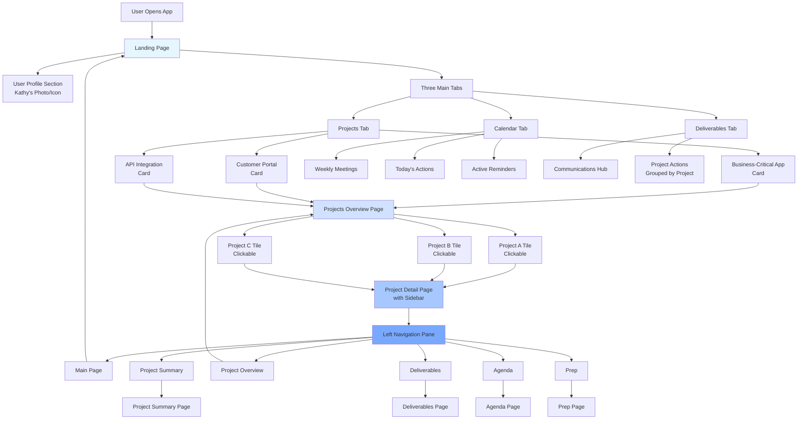
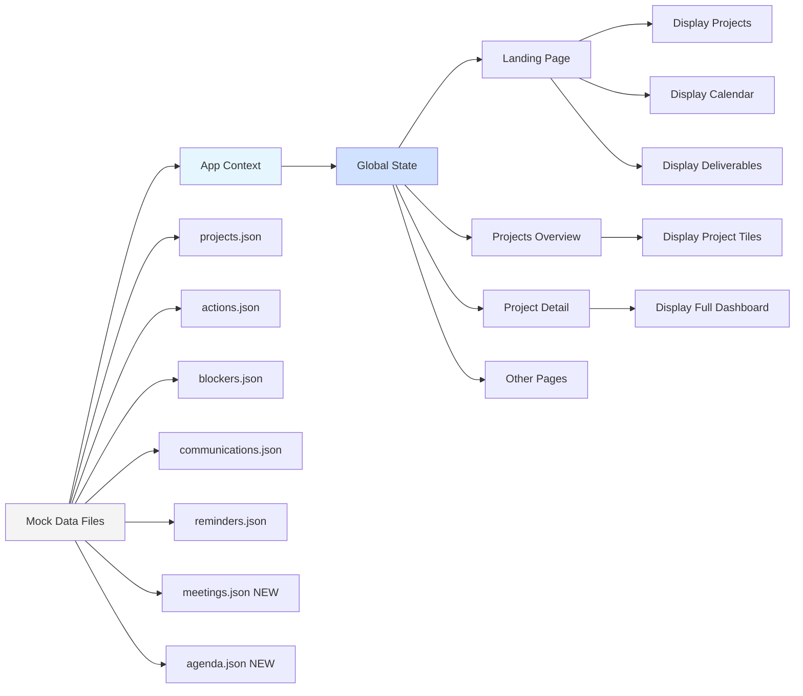
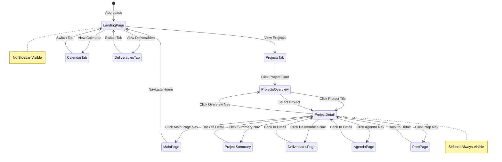
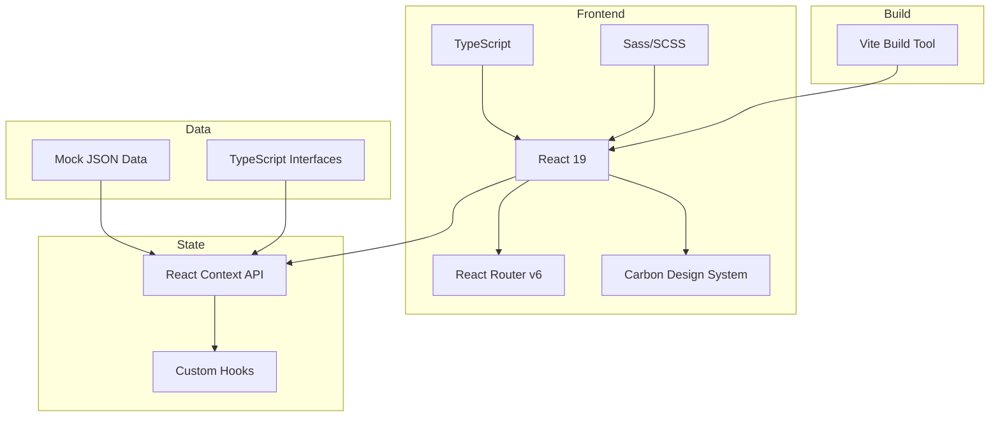

# Kathy's Command Centre - Architecture Diagram

## Application Flow Architecture



## Component Hierarchy

```mermaid
graph TD
    App[App.tsx<br/>Router Provider] --> Router{React Router}
    
    Router --> Route1[/ Landing Page Route]
    Router --> Route2[/app/* Main App Routes]
    
    Route1 --> LandingPage[LandingPage Component]
    
    LandingPage --> UserSection[User Profile Section]
    LandingPage --> TabsComponent[Tabs Component]
    
    TabsComponent --> Tab1[Projects Tab Content]
    TabsComponent --> Tab2[Calendar Tab Content]
    TabsComponent --> Tab3[Deliverables Tab Content]
    
    Tab1 --> ProjectCards[3 Project Cards]
    Tab2 --> CalendarContent[Calendar Grid + Actions + Reminders]
    Tab3 --> DeliverContent[Communications + Actions by Project]
    
    Route2 --> MainLayout[MainAppLayout Component]
    
    MainLayout --> SidebarNav[Sidebar Navigation]
    MainLayout --> ContentOutlet[Router Outlet]
    
    ContentOutlet --> Page1[Projects Overview Page]
    ContentOutlet --> Page2[Project Detail Page]
    ContentOutlet --> Page3[Project Summary Page]
    ContentOutlet --> Page4[Deliverables Page]
    ContentOutlet --> Page5[Agenda Page]
    ContentOutlet --> Page6[Prep Page]
    
    Page1 --> ProjectTiles[3 Clickable Project Tiles]
    Page2 --> ExistingDash[Existing CommandCentre<br/>Actions, Blockers, etc.]
    
    style App fill:#f4f4f4
    style LandingPage fill:#e5f6ff
    style MainLayout fill:#d0e2ff
    style SidebarNav fill:#a6c8ff
```

## Data Flow Architecture



## Navigation State Machine



## Page Layout Structure

### Landing Page Layout
```
┌─────────────────────────────────────────────────────────┐
│                    Header (Carbon)                       │
│              Kathy's Command Centre                      │
└─────────────────────────────────────────────────────────┘
┌─────────────────────────────────────────────────────────┐
│                                                          │
│              ┌─────────────────────┐                    │
│              │                     │                    │
│              │   User Photo/Icon   │                    │
│              │   (Placeholder)     │                    │
│              │                     │                    │
│              └─────────────────────┘                    │
│                                                          │
│              Welcome, Kathy                              │
│                                                          │
└─────────────────────────────────────────────────────────┘
┌─────────────────────────────────────────────────────────┐
│  ┌─────────┬─────────┬─────────┐                       │
│  │Projects │Calendar │Deliver. │  (Tabs)               │
│  └─────────┴─────────┴─────────┘                       │
│  ┌───────────────────────────────────────────────────┐ │
│  │                                                   │ │
│  │              Tab Content Area                     │ │
│  │                                                   │ │
│  │  - Projects: 3 Project Cards                     │ │
│  │  - Calendar: Meetings + Actions + Reminders      │ │
│  │  - Deliverables: Communications + Actions        │ │
│  │                                                   │ │
│  └───────────────────────────────────────────────────┘ │
└─────────────────────────────────────────────────────────┘
```

### Main App Layout (with Sidebar)
```
┌─────────────────────────────────────────────────────────┐
│                    Header (Carbon)                       │
└─────────────────────────────────────────────────────────┘
┌──────────────┬──────────────────────────────────────────┐
│              │                                          │
│   Sidebar    │         Content Area                     │
│   (256px)    │                                          │
│              │                                          │
│ ┌──────────┐ │  ┌────────────────────────────────┐    │
│ │Main Page │ │  │                                │    │
│ └──────────┘ │  │                                │    │
│ ┌──────────┐ │  │     Page Content               │    │
│ │Project   │ │  │     (Route-based)              │    │
│ │Summary   │ │  │                                │    │
│ └──────────┘ │  │                                │    │
│ ┌──────────┐ │  │                                │    │
│ │Project   │ │  │                                │    │
│ │Overview  │ │  │                                │    │
│ └──────────┘ │  └────────────────────────────────┘    │
│ ┌──────────┐ │                                          │
│ │Deliver.  │ │                                          │
│ └──────────┘ │                                          │
│ ┌──────────┐ │                                          │
│ │Agenda    │ │                                          │
│ └──────────┘ │                                          │
│ ┌──────────┐ │                                          │
│ │Prep      │ │                                          │
│ └──────────┘ │                                          │
│              │                                          │
└──────────────┴──────────────────────────────────────────┘
```

## Technology Stack



---

**Document Version**: 1.0  
**Created**: 2026-06-04  
**Purpose**: Visual architecture reference for implementation